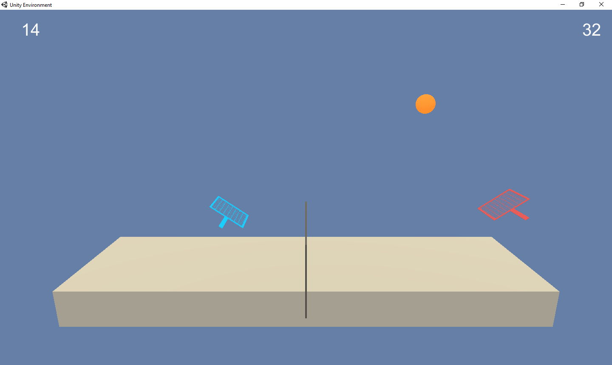

# Tennis game

---
Created by Jesper Højmark Esbensen, 2018-12-03. 
 

This project will create and train two agents in a Unity Machine Learning environment to play Tennis. The solution is based on the general deep reenforcement learning agent supplied in the course [Deep Reinforcement Learning Nanodegree](https://www.udacity.com/course/deep-reinforcement-learning-nanodegree--nd893).

The environment is a tennis court where two tennis players play with each other. The agent can move closer or further way from the net and jump. Two continouos actions. When a player hits the ball over the net it is rewarded with 0.1 points. When the player drops the ball or shoots it out of bounds a reward of -0.01 is given. The setup will result in two players playing with each other to get a high score and therefor playing as long as possible, The environment is solved when an average score over 100 episodes is reached. The score pr game is taken as the highes of the two players score. 

### 1. Installation instructions

The playground is a Unity environment and the agents solving it are build in the pytorch/python script in this repository. The scripts is run in a Jupyter notebook. Therefore running it will need some setup of tools and environment.

You will need to install python 3.6 and a few packages. One popular way to install python is through Anaconda. A python/R environment. To install this follow the instructions on: https://www.anaconda.com/distribution/.
Tennis.png
Create an python environment using the "Create" button and select the python 3.6 version. Start a terminal for the environment and install jupyter.

Install jupyter in the environment. 

    python -m pip install --upgrade pip
    python -m pip install jupyter
   
or reference jupyters home page if you have problems: http://jupyter.org/install

The agent is bulid using Facebook's pyTorch. To install run the followin commands.

    conda install pytorch -c pytorch 
    pip3 install torchvision
    
or reference pyTorch's home page if you have problems: https://pytorch.org/

The environment is build on Unitys ML-agents modul. To run these you will need TensorFlow:

    pip install tensorflow==1.7.1

or reference TensorFlow's home page if you have problems: https://www.tensorflow.org/

Then install the ML-agenst from Unity.
Clone the repository: git clone https://github.com/Unity-Technologies/ml-agents.git
find and change to the directory: ml-agents/python and install the ml-agenst with:

    pip install .

or reference this page if you have problems: https://github.com/Unity-Technologies/ml-agents/blob/master/docs/Installation-Windows.md

### 2. Clone the "Tennis game" project

To download this repository and run the reacher agent on your machine clone this github repository with the following command:

    git clone https://github.com/JesperEsbensen/drlnd_collaboration_and_competition_project

when cloned unpack the Tennis_Windows_x86_64 in the same location so you get a subfolder: Tennis_Windows_x86_64. If you unpack the environment in a different location you will need to change the path to the environment in the notebook accordingly.

### 3. Train the agent

When you have installed all above packages and cloned the repository to your machine you can open and run the jupyter notebook Report.ipynb. Open the notebook with the following command.

    jupyter notebook
    
Browse to the notebook and open it.

